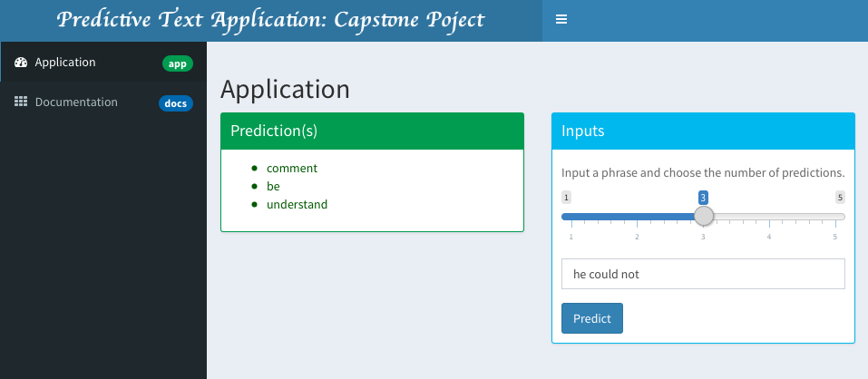

Predictive Text Algorithm: Capstone Project
========================================================
author: Zainil Jessani
date: July 17, 2016
autosize: true

This presentation will highlight the use of the product, how the predictive model works, and the performance of the algorithm.

This Capstone project was possible thanks to Coursera, Johns Hopkins Bloomberg School of Public Health and SwiftKey. 

Mission
========================================================

When we type on keyboards we need to specify each letter to create a word or a phrase which we then send to our friends, family, and loved ones. The time spent composing the message is lengthened by the manual input system found on most keyboards.

The Predictive Text Algorithm is a Shiny hosted online application that can be adapted to mobile devices in order to reduce the time spent typing on keyboards and gaining meaningful interactions with others.

Approach
========================================================

The prediction model was developed by using resources from various university courses that cover Natural Language Processing (NLP) while a few highly accurate techniques were rather promising, the performance constraints they presented were too great.

In the end a Maximum Likelihood Model (MLE) was developed, prediciting single words based on frequency counts. The model takes in up to 3 previously typed words in order to make it's prediction.

Considering the accuracy tradeoff that was made in order to achieve acceptable perfomance an area of creative exploration might be in the storage of the Corpus to free up memory. 

Application & Features
========================================================

Basics: Takes in a word (or phrase) and number of predictions. After you press "Predict" it gives you possibilities for the next word.

References
========================================================
- The application can be found at: https://zjessani.shinyapps.io/shiny/
- The code used to create the product is available through: https://github.com/minuseighty/CapstoneDataScienceProject
- Milestone Report: https://rpubs.com/zainilj/190536
- Coursera Data Science Specialization: https://www.coursera.org/learn/data-science-project/home/welcome
